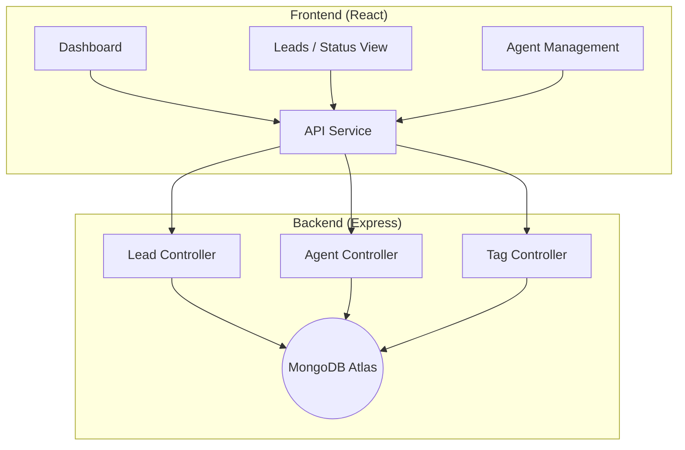

# 🚀 Anvaya CRM 

**Anvaya CRM** is a powerful, modern, and aesthetically elegant Lead Management System built for sales teams that demand speed and clarity. Designed with a premium glassmorphic aesthetic, it provides a high-level overview of your sales pipeline while allowing deep dives into individual lead journeys.

---

## 🌟 Key Features

- **📊 Strategic Analytics Dashboard**: Instantly track your pipeline health with real-time distribution charts and performance metrics.
- **⚡ Dynamic Pipeline Tracking**: Monitor leads through 5 distinct stages (*New, Contacted, Qualified, Proposal Sent, Closed*) with synchronized color coding across the entire app.
- **👥 Multi-Agent Collaboration**: Assign leads to specific sales agents and track their individual performance via dedicated agent views.
- **🏷️ Smart Tagging & Filtering**: Categorize leads with custom tags and find what you need instantly with multi-parameter filtering.
- **📝 Contextual Activity Logs**: Never lose context with a built-in commenting system for every lead.
- **🌑 Premium Glassmorphism UI**: A state-of-the-art interface built with Tailwind CSS for a professional, blurred-glass look.

---

## 🏗️ Architecture



---

## 🛠️ Tech Stack

### **Frontend**


### **Backend**


---

## ⚙️ Getting Started

To get the project running locally, follow these steps:

### **1. Clone the repository**
```bash
git clone https://github.com/aaquib132/anvaya-crm.git
cd anvaya-crm
```

### **2. Setup Backend**
```bash
cd Backend
npm install
```
Create a `.env` file in the `Backend` directory:
```env
MONGODB_URI=your_mongodb_atlas_uri
PORT=3000
```
Run the server:
```bash
npm run dev
```

### **3. Setup Frontend**
```bash
cd ../frontend
npm install
```
Run the frontend:
```bash
npm run dev
```

---

## 📐 Project Structure

```bash
Anvaya CRM/
├── Backend/          # Express.js Server
│   ├── config/       # DB Connection
│   ├── controllers/  # Business Logic
│   ├── models/       # Mongoose Schemas
│   └── routes/       # API Endpoints
└── frontend/         # React.js App
    ├── src/
    │   ├── components/ # Reusable UI
    │   ├── context/    # Global State
    │   ├── pages/      # View Routes
    │   └── services/   # API Connection
```

---

## 🤝 Contributing

Contributions are what make the open source community such an amazing place to learn, inspire, and create. Any contributions you make are **greatly appreciated**.

---

## 📄 License

Distributed under the MIT License. See `LICENSE` for more information.
